# Bot Permission Issue

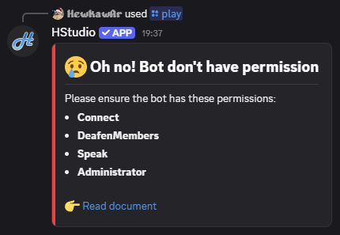

## On Desktop/PC

### 1. Server Settings

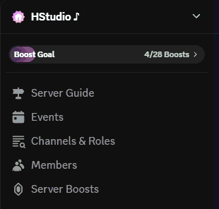

### 2. Go to “Roles”

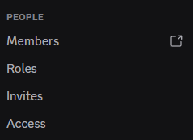

### 3. Scroll to find “HStudio”

### 4. Grant permissions to the bot

**Voice Channel Permissions**

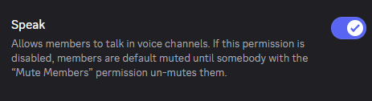
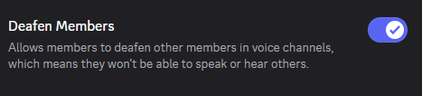

**Advanced Permissions**
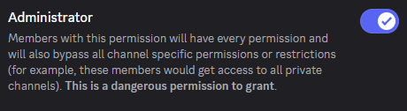

---

## On Mobile

### 1. Server

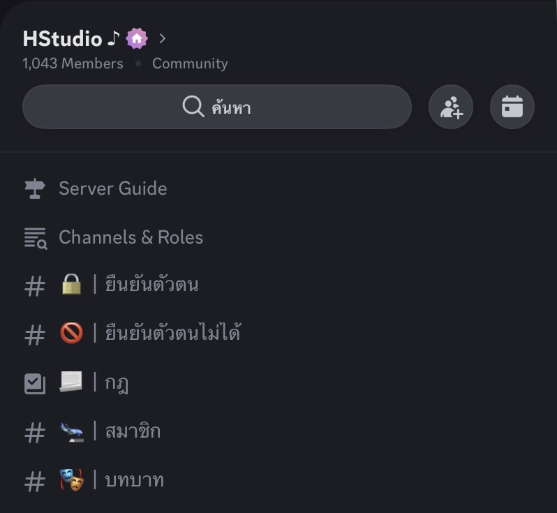

### 2. Settings

### 3. Roles

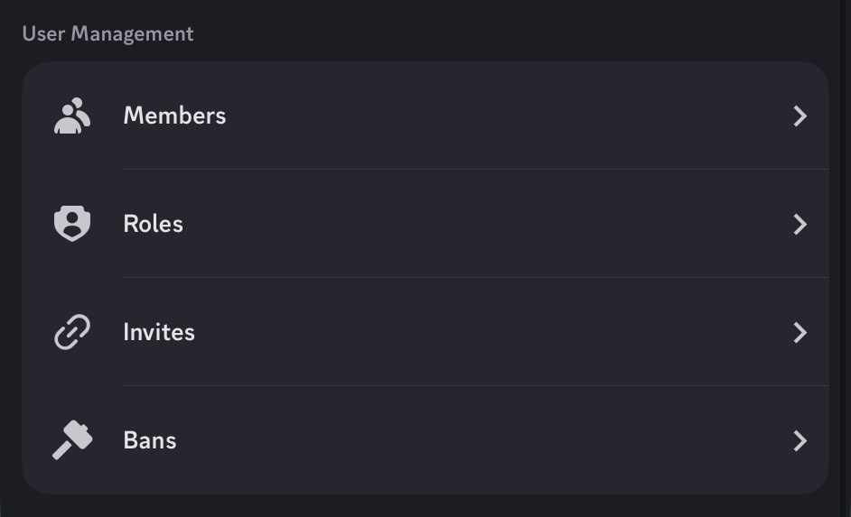

### 4. HStudio

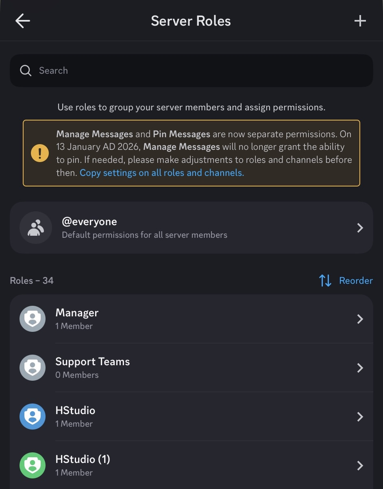

### 5. Permissions

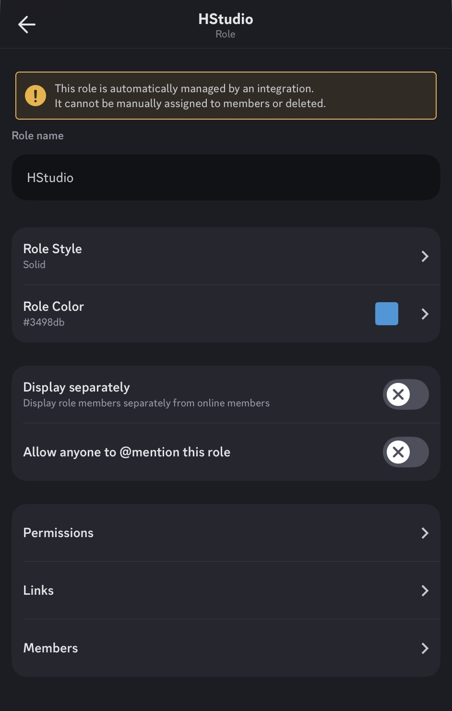

### 6. Grant permissions to the bot

**Voice Channel Permissions**
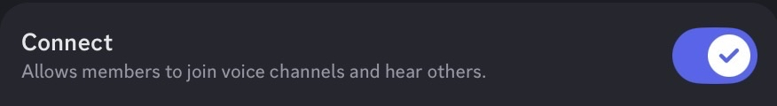
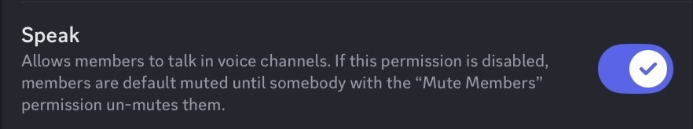
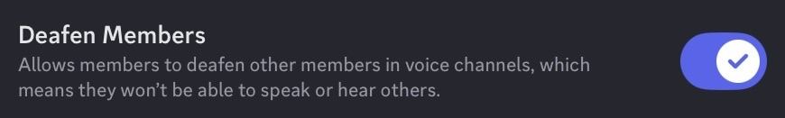

**Advanced Permissions**
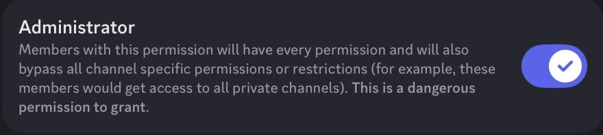

---

If you want, I can also rewrite it to be clearer, shorter, or more professional!
