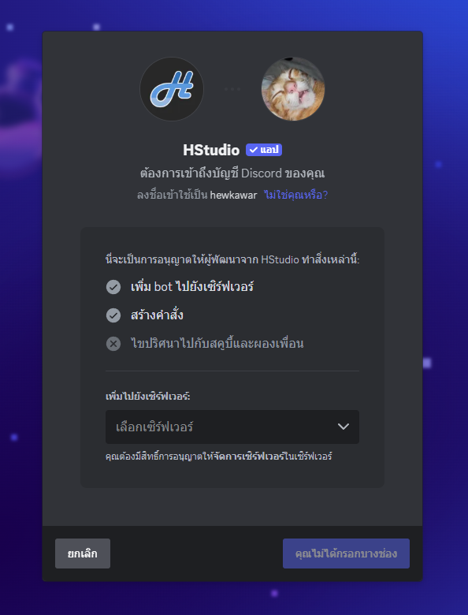
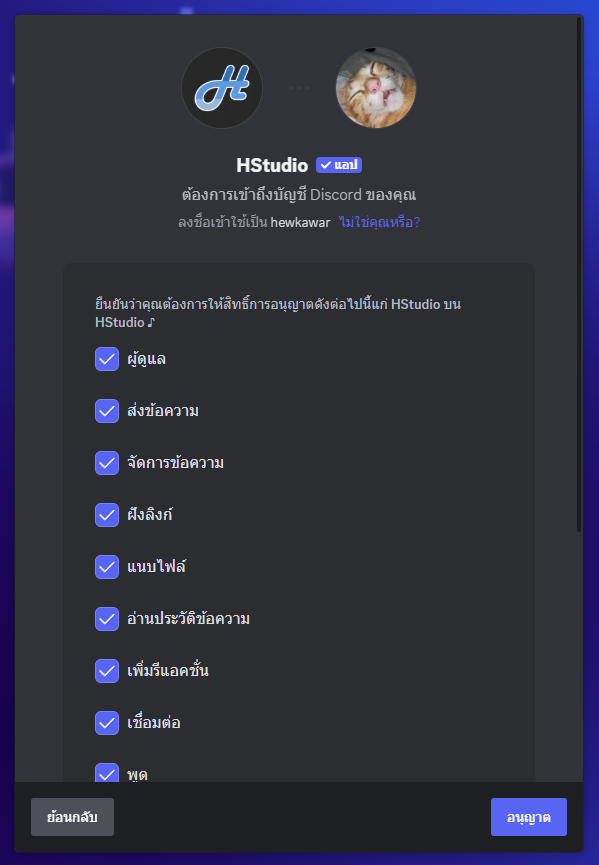

# Invite Bot

You can easily invite the bot through 2 main methods

::: tip
Add the bot to your server before using the bot every time
:::

### 1. Direct bot invitation link

[https://discord.com/oauth2/authorize?client_id=1105873690022924450](https://discord.com/oauth2/authorize?client_id=1105873690022924450)

### 2. Select the server you want to add the bot to

### 3. Click authorize to add the bot to the server

### 4. When you return to the server, you will see the bot has joined the server

