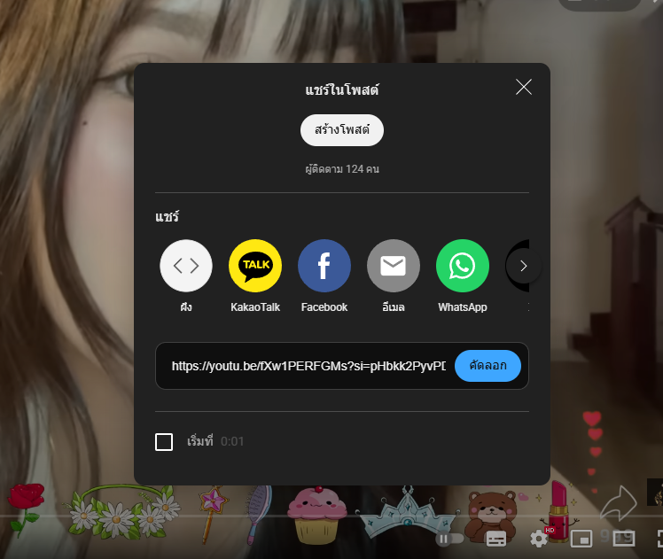
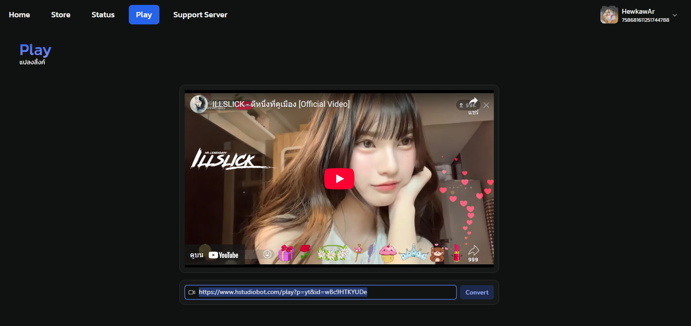
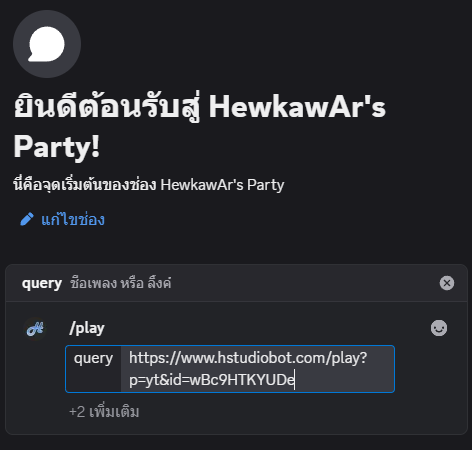

# Listen to Music via Youtube

::: warning
The bot must already be in your server to use this feature. [Invite the bot](./invite-bot.md)
:::

### 1. Join the voice channel where you want to listen to music

### 2. Copy the Youtube link

### 3. Paste the copied link into HStudio Play to convert it

[https://www.hstudiobot.com/play](https://www.hstudiobot.com/play)

### 4. Copy the link generated by HStudio Play

### 5. Paste the copied music link to play the song

### 6. Press Enter to send the command. The bot will join and play the music.

