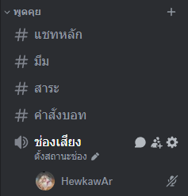

# ฟังเพลงผ่าน Activity


ต้องมีบอทอยู่ในเซิร์ฟเวอร์อยู่แล้วถึงจะใช้งานได้ [README (1).md](<../README (1).md> "mention")


### 1. เข้าห้องเสียงที่ต้องการฟังเพลง

<figure><figcaption></figcaption></figure>

### 2. กดที่ปุ่ม "เริ่มกิจกรรม"

<figure><figcaption></figcaption></figure>

### 3. เลือก "HStudio"

<figure><figcaption></figcaption></figure>

### 4. กดที่ปุ่ม "เริ่ม"

<figure><figcaption></figcaption></figure>

### 5. จะได้หน้าต่างกิจกรรมขึ้นมา

<figure><figcaption></figcaption></figure>

### 6. ค้นหาเพลงที่ต้องการแล้วกด Add Queue

<figure><figcaption></figcaption></figure>

### 7. บอทจะเข้ามาเปิดเพลงให้ฟัง

<figure><figcaption></figcaption></figure>

