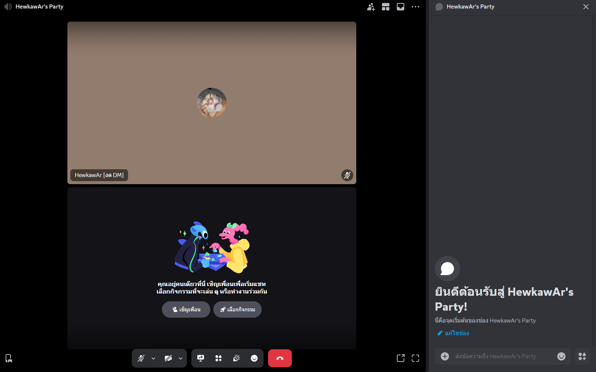
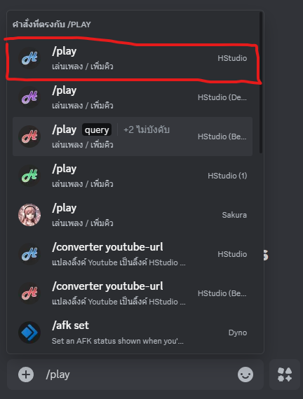
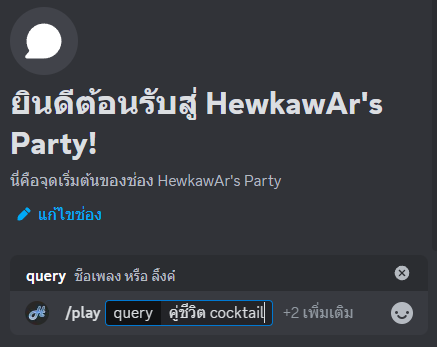
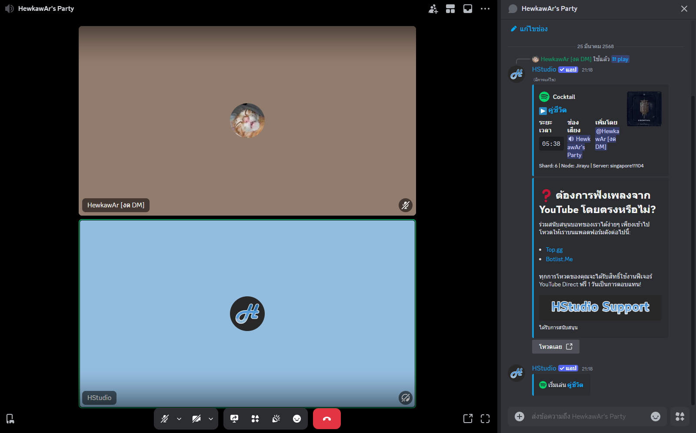

# ฟังเพลงแรก


ต้องมีบอทอยู่ในเซิร์ฟเวอร์อยู่แล้วถึงจะใช้งานได้ [README (1).md](<../README (1).md> "mention")


### 1. เข้าห้องเสียงที่ต้องการฟังเพลง

<figure><figcaption></figcaption></figure>

### 2. เปิดช่องแชทเพื่อพิมพ์คำสั่ง

<figure><figcaption></figcaption></figure>

### 3. พิมพ์ /play ในช่องแชทแล้วเลือกคำสั่งที่เป็นของบอท HStudio

<figure><figcaption></figcaption></figure>

### 4. กรอกชื่อเพลง หรือ ลิ้งค์เพลงที่ต้องการฟัง

<figure><figcaption></figcaption></figure>

### 5. กด Enter เพื่อส่งคำสั่ง บอทจะเข้ามาเปิดเพลงให้ฟัง

<figure><figcaption></figcaption></figure>
