# แก้ปัญหาบอทไม่มีสิทธิ์เล่นเพลง

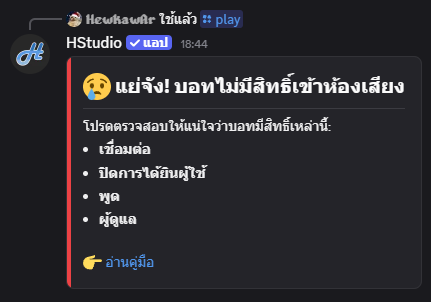

## บน Desktop/PC

### 1. ตั้งค่าเซิฟเวอร์

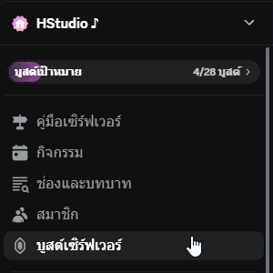

### 2. ไปที่ "บทบาท"

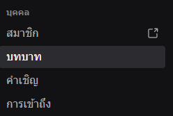

### 3. เลื่อนหา "HStudio"

### 4. ให้สิทธิ์กับบอท

**สิทธิ์อนุญาตในช่องสำหรับพูด**

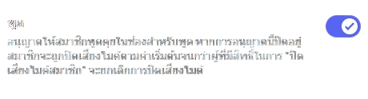
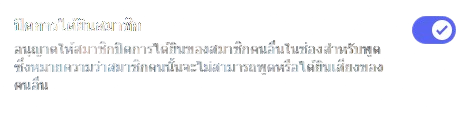

**สิทธิ์การอนุญาตขั้นสูง**
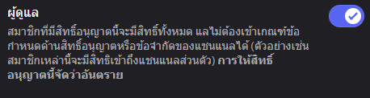

## บทมือถือ

### 1. เซิฟเวอร์

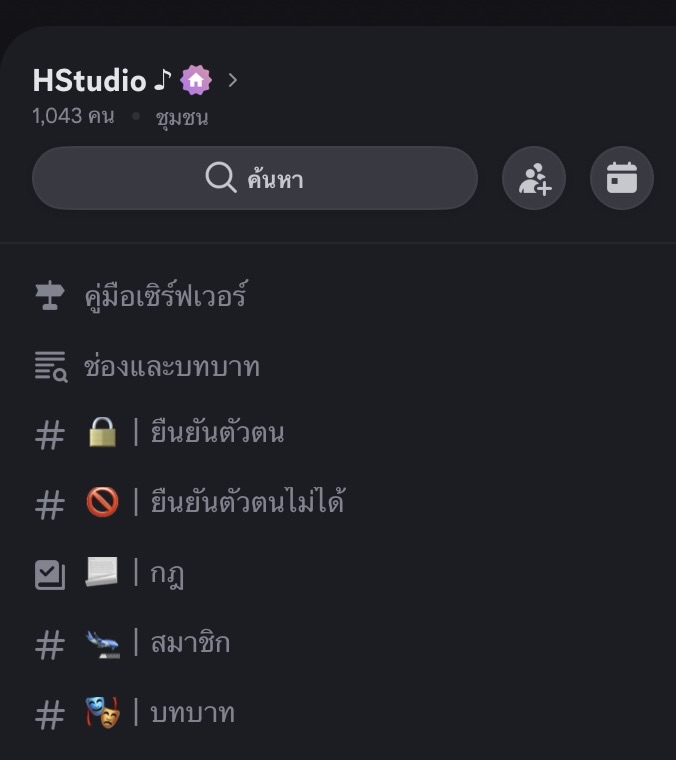

### 2. การตั้งค่า

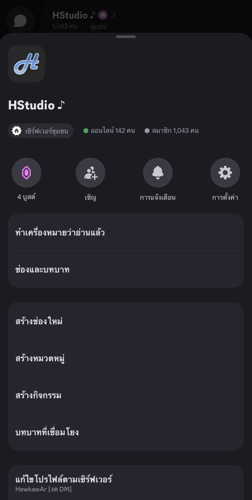

### 3. บทบาท

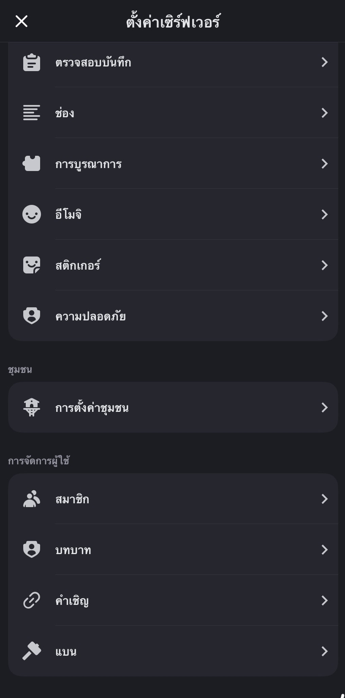

### 4. HStudio

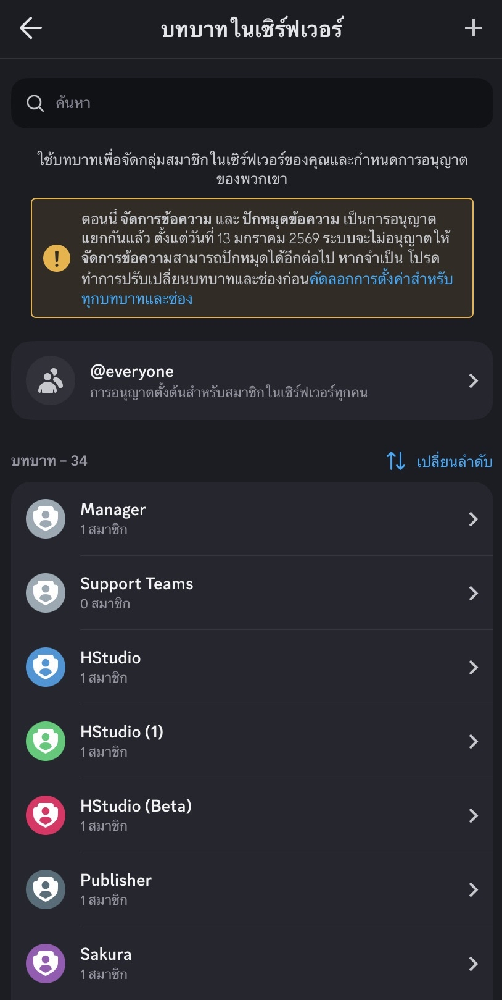

### 5. การอนุญาต

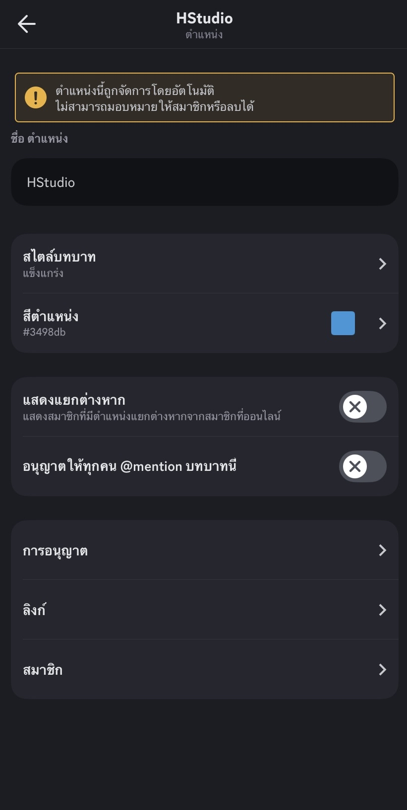

### 6. ให้สิทธิ์กับบอท

**สิทธิ์อนุญาตในช่องสำหรับพูด**

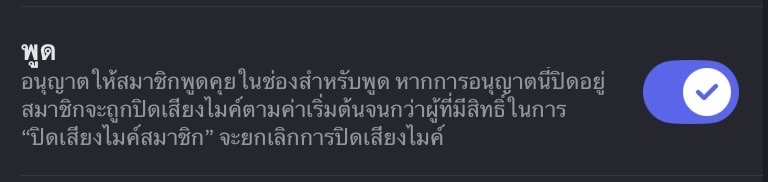

**สิทธิ์การอนุญาตขั้นสูง**
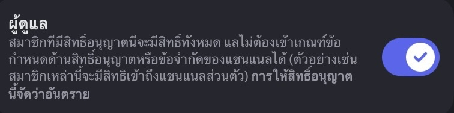
