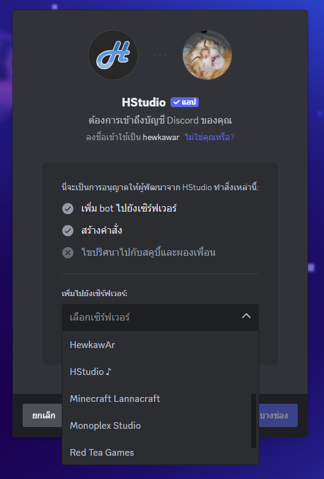
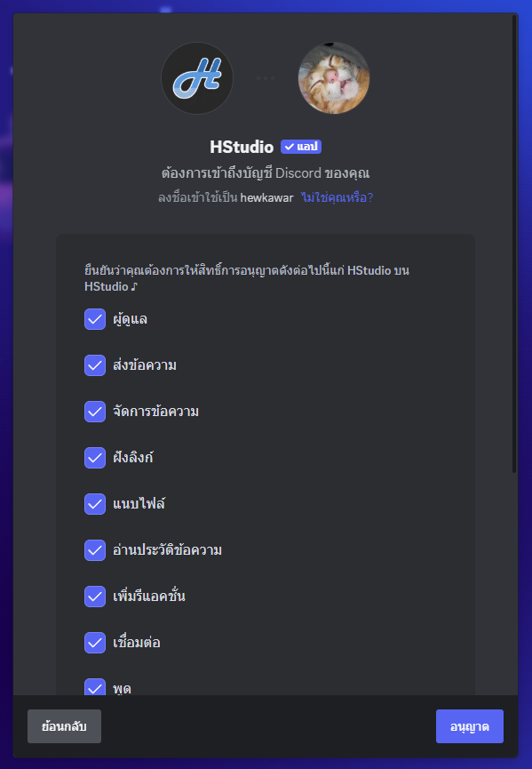

# เชิญบอท

เชิญบอทสามารถเชิญได้ง่ายๆ ผ่าน 2 วิธีหลักๆ

::: tip
เพิ่มบอทไปยังเซิร์ฟเวอร์ก่อนใช้งานบอททุกครั้ง
:::

### 1. ลิ้งค์เชิญบอทโดยตรง

[https://discord.com/oauth2/authorize?client_id=1105873690022924450](https://discord.com/oauth2/authorize?client_id=1105873690022924450)

### 2. เลือกเซิร์ฟเวอร์ที่ต้องการเพิ่มบอท

### 3. กดอนุญาตเพื่อเพิ่มบอทไปยังเซิร์ฟเวอร์

### 4. เมื่อกลับไปยังเซิร์ฟเวอร์ก็จะเห็นบอทเข้ามาในเซิร์ฟเวอร์แล้ว

