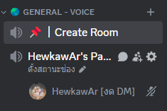
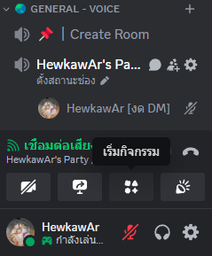
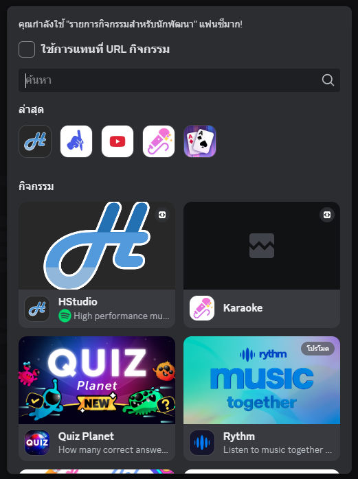
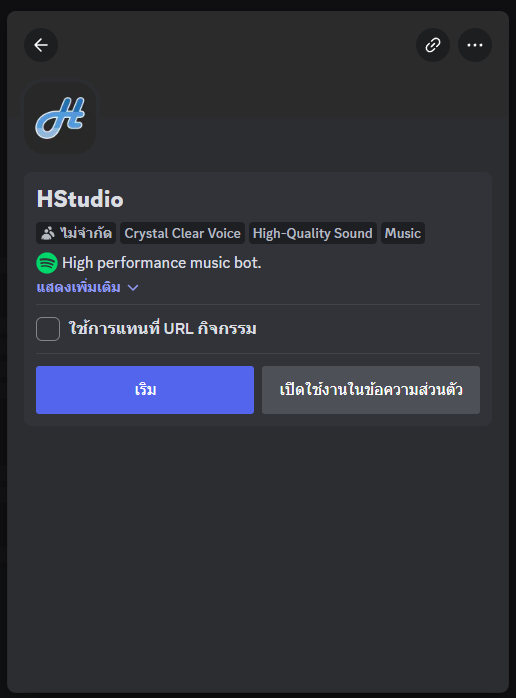
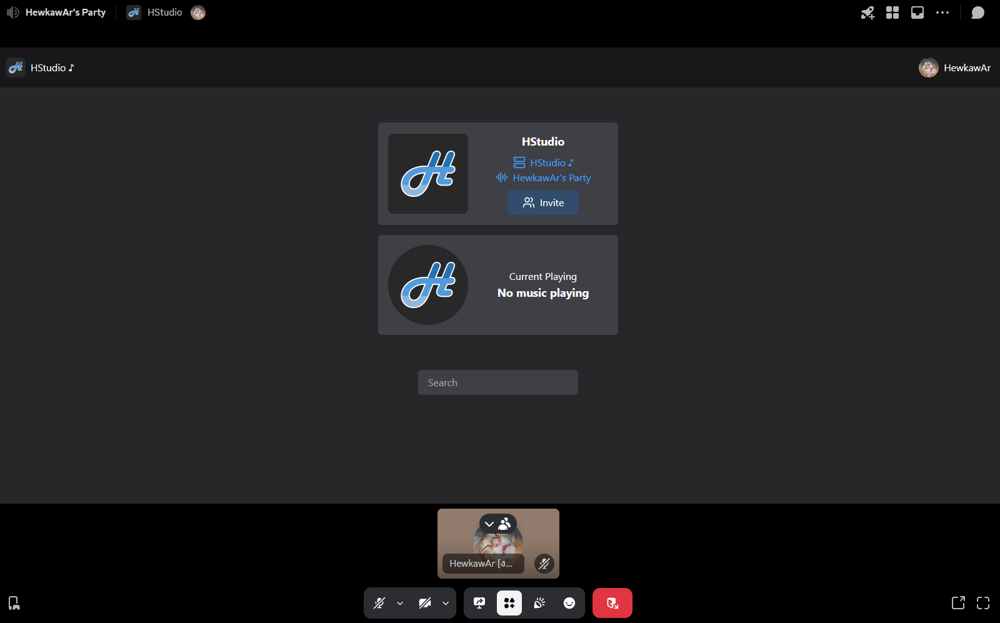
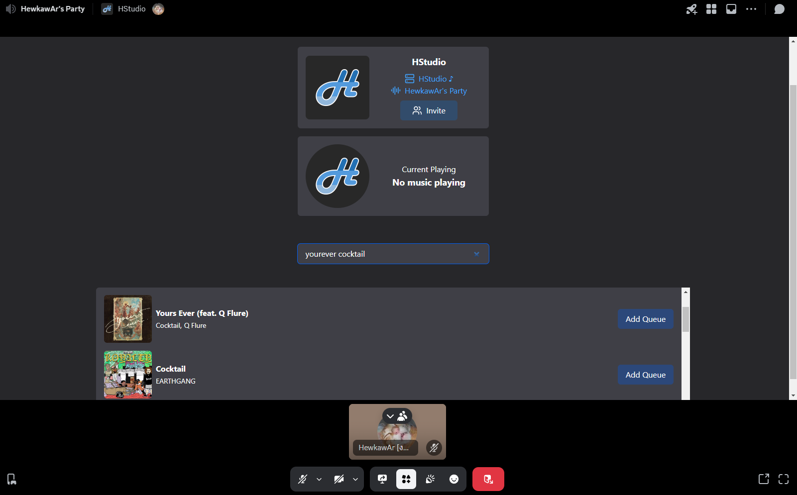
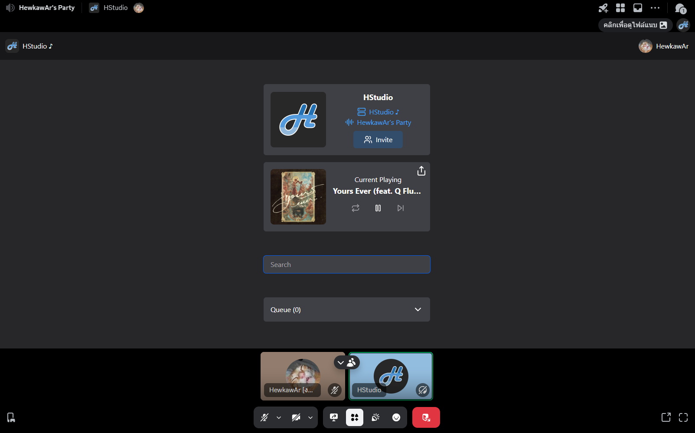

# ฟังเพลงผ่าน Activity

::: warning
ต้องมีบอทอยู่ในเซิร์ฟเวอร์อยู่แล้วถึงจะใช้งานได้ [เชิญบอท](./invite-bot)
:::

### 1. เข้าห้องเสียงที่ต้องการฟังเพลง

### 2. กดที่ปุ่ม "เริ่มกิจกรรม"

### 3. เลือก "HStudio"

### 4. กดที่ปุ่ม "เริ่ม"

### 5. จะได้หน้าต่างกิจกรรมขึ้นมา

### 6. ค้นหาเพลงที่ต้องการแล้วกด Add Queue

### 7. บอทจะเข้ามาเปิดเพลงให้ฟัง

