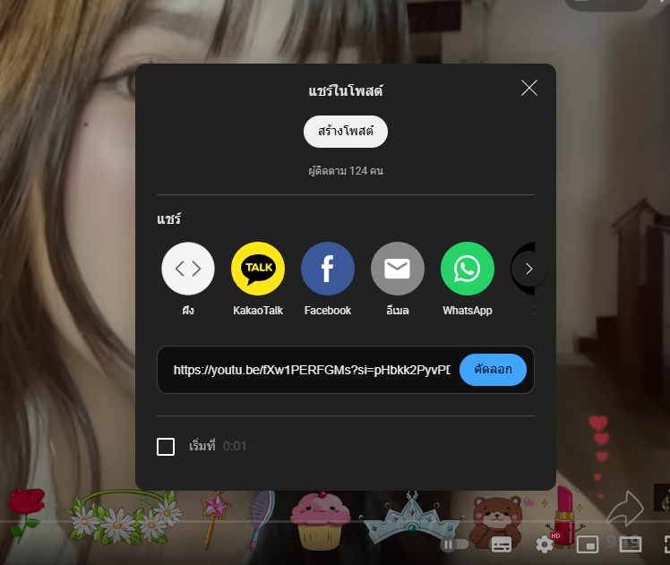
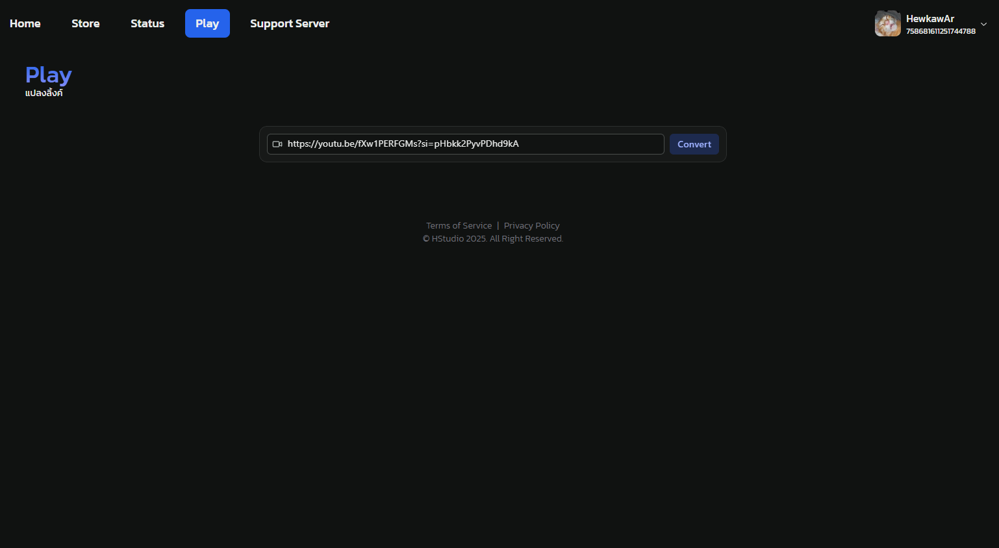
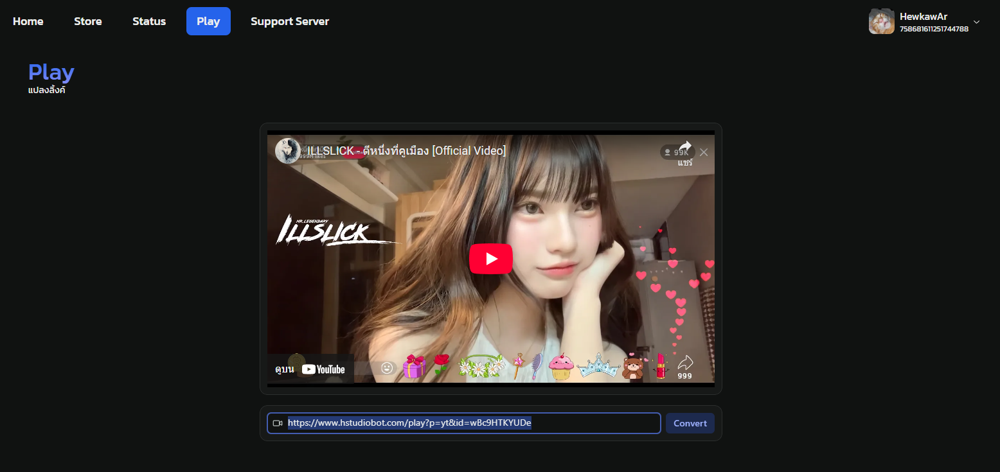
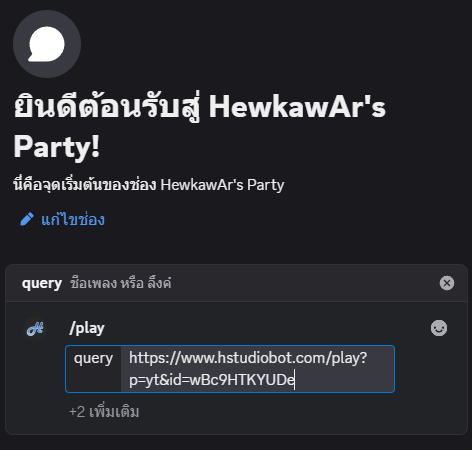
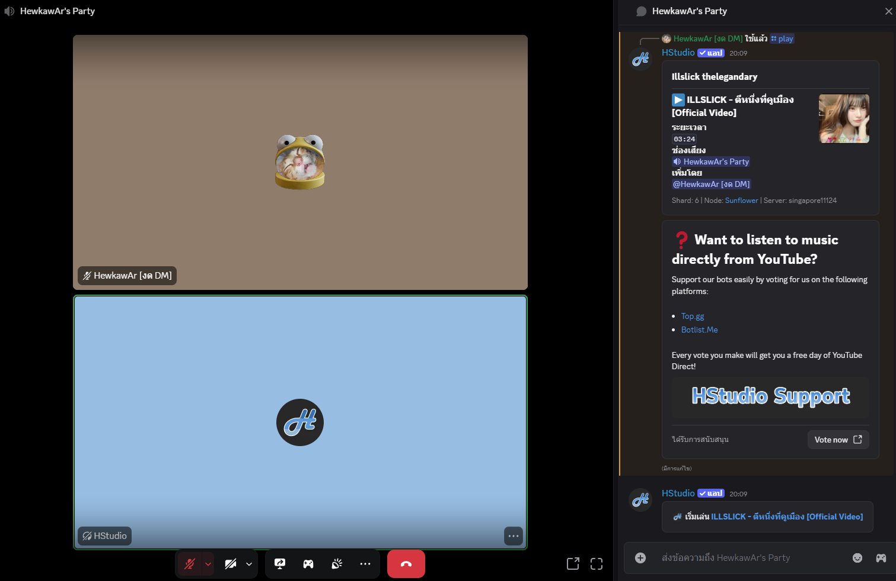

# ฟังเพลงผ่าน Youtube

::: warning
ต้องมีบอทอยู่ในเซิร์ฟเวอร์อยู่แล้วถึงจะใช้งานได้ [เชิญบอท](./invite-bot.md)
:::

### 1. เข้าห้องเสียงที่ต้องการฟังเพลง

### 2. คัดลอกลิ้งค์ Youtube

### 3. นำลิ้งค์ที่คัดลอกมาแปลงลิ้งค์ใน HStudio Play

[https://www.hstudiobot.com/play](https://www.hstudiobot.com/play)

### 4. คัดลอกลิ้งค์ที่ได้จาก HStudio Play

### 5. วางลิ้งค์เพลงที่คัดลอกเพื่อเล่นเพลง

### 6. กด Enter เพื่อส่งคำสั่ง บอทจะเข้ามาเปิดเพลงให้ฟัง

